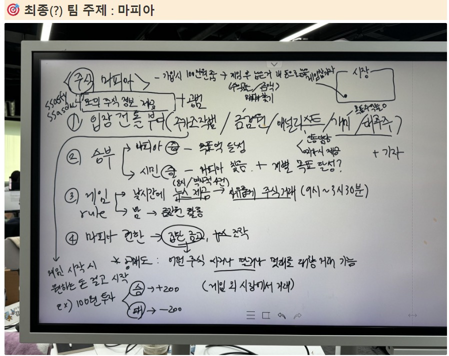
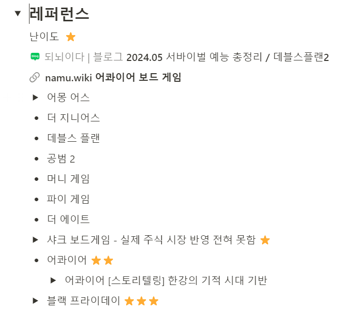

2주차

# 📍 09.05(9th)

### 오늘 한 것

-   과업 정리하기
-   메인 에셋 선정
-   프론트엔드 프로젝트 초기 설정
-   프론트엔드,벡엔드 인원별 분담 할 역할 정리

### 내일 할 일

-   메인 에셋 구매하기
-   UI 서브에셋 검색하기
-   WebSocket관련 Message 규약 작성
-   RTF 공부하기

### 느낀점

-   사소한 작업이라도 과업을 리스트로 정리하여 정리한 내용을 바탕으로 역할 분담을 해야겠다.

---

1주차

## 8/27(화)
- 2차 팀 미팅
    - 탈북민 대상 지원금 안내 or 경제용어 교육
    - 프리랜서 특화 세금 및 회계 자동화 도구
    - 신용 점수 관리 어플
    - 주식 시뮬레이션

## 8/28(수)
- 3차 팀 미팅
    - 핀테크 프로젝트 기획 보고서 : 향수 추천 사이트
    - 핀테크 다이어리 앱

- 오늘 각자 해야 할 일 : 2가지로 좁혀진 위의 2가지 주제 중 원하는 주제 구체화해보기

## 8/29(목)

## 8/30(금)

